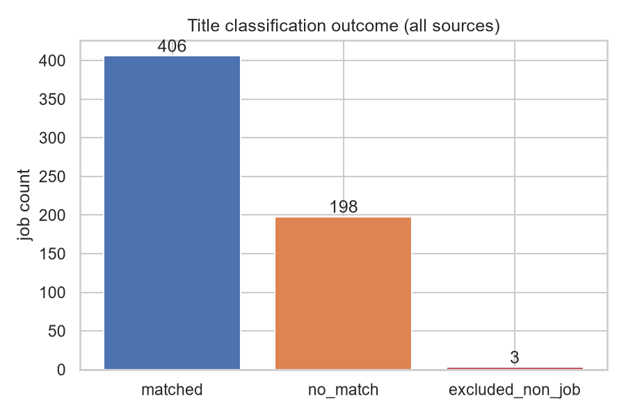
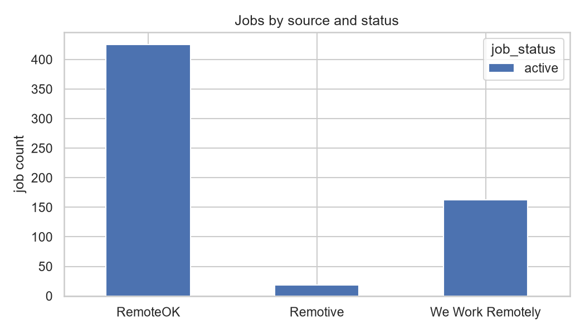
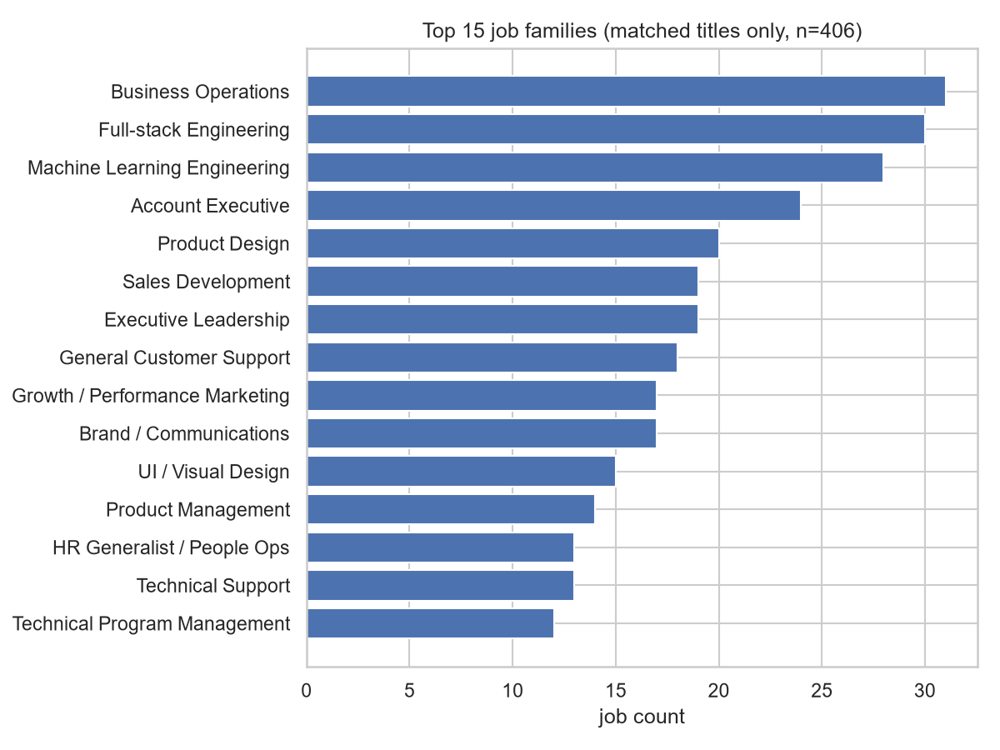
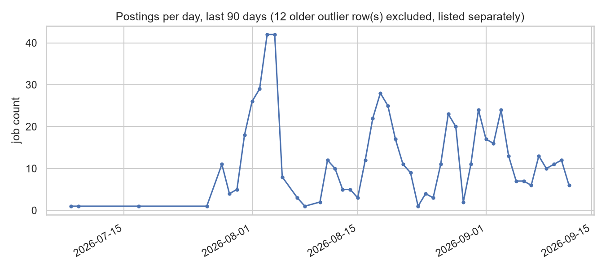
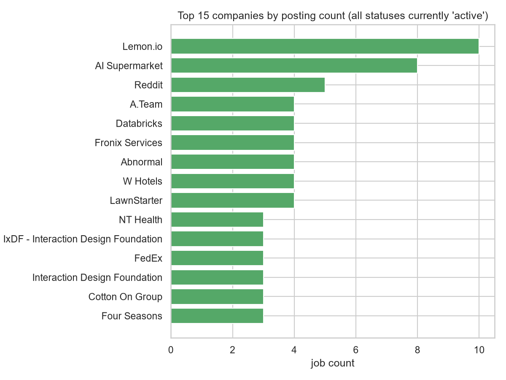
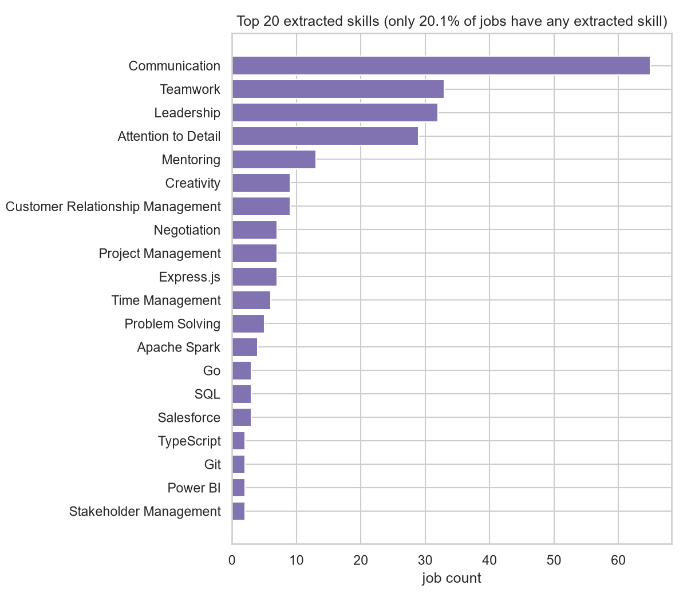

# Step 30 - Exploratory Data Analysis

Generated against Neon production. Dataset size at generation time: **607 jobs**.

This report includes an honest data-completeness section before any market-composition claims, because several core dimensional fields are currently unpopulated and several other fields are populated for only a small fraction of the dataset. Every chart below is scoped to what the current data can actually support.

## Data completeness

| Column | Null count | Null % |
|---|---|---|
| `job_category_id` | 607 | 100.0% |
| `experience_level_id` | 607 | 100.0% |
| `employment_type_id` | 607 | 100.0% |
| `education_level_id` | 607 | 100.0% |
| `remote_work_type_id` | 607 | 100.0% |
| `industry_id` | 607 | 100.0% |
| `location_id` | 246 | 40.5% |
| `normalized_title_id` | 201 | 33.1% |

**6 column(s) are 100% null as of this run**: `job_category_id`, `experience_level_id`, `employment_type_id`, `education_level_id`, `remote_work_type_id`, `industry_id`. No breakdown by these dimensions appears anywhere below, because there is no data to break down.

## Title classification quality

`matched`: 406 (66.9%) | `no_match`: 198 (32.6%) | `excluded_non_job`: 3 (0.5%)

`excluded_non_job` currently only catches the literal string "test". `no_match` is a mix of genuine jobs outside the current title taxonomy's scope and unfiltered scrape noise (personal names, menu items, template text). By agreed scope, company/skill/salary/volume charts below include both `matched` and `no_match` jobs. Job-family and normalized-title charts can only use `matched` jobs, since `no_match` rows have no normalized title by definition.

## Sources and status

Every job in the dataset currently has `job_status = 'active'` - the pipeline has never flipped a posting to `closed`/`expired`. This is a known, documented gap; treat 'active' as meaning "currently tracked," not "confirmed still open."

## Job families

Matched jobs only (n=406).

## Posting volume over time

Postings older than 90 days before the most recent posting_date are excluded from the chart and listed here instead, so a small number of old outliers can't distort the visible trend.

**12 outlier posting(s) excluded from the chart above:**

| job_id | source | title | posting_date |
|---|---|---|---|
| 335 | We Work Remotely | Marketing Automation SaaS + Services Line of Business Owner | 2023-02-07 |
| 334 | We Work Remotely | FT/PT Remote AI Prompt Engineering & Evaluation - Will Train | 2023-06-21 |
| 333 | We Work Remotely | Senior Independent Software Developer ($90-$170/hr) | 2024-06-16 |
| 332 | We Work Remotely | Senior Independent AI Engineer / Architect | 2024-06-16 |
| 494 | We Work Remotely | Growth Lead | 2025-05-13 |
| 493 | We Work Remotely | Remote Data Entry Clerk | 2025-11-11 |
| 331 | We Work Remotely | Business Analyst | 2026-03-23 |
| 584 | We Work Remotely | Inside Sales - Account Executive | 2026-04-13 |
| 330 | We Work Remotely | Remote Inside Sales | 2026-05-06 |
| 602 | We Work Remotely | Software engineer | 2026-05-14 |
| 620 | We Work Remotely | Client Success Advisor | 2026-05-15 |
| 329 | We Work Remotely | Mac MSP Help Desk Guru (work from home) | 2026-05-28 |

## Companies

## Skills

Only 122/607 jobs (20.1%) have any extracted skill at all. The extractor is rule-based and, on this data, skews heavily toward generic soft skills (Communication, Teamwork, Leadership) over hard technical skills - treat this as a coverage/extraction-method finding, not a market finding about what employers actually want.

## Salary

Only 20/607 jobs (3.3%) have a disclosed salary - too small a sample to support any distributional claim (average, median, by-title comparison).

**6 of 20 disclosed-salary rows look wrong, not just sparse** - implausible values (e.g. an annual figure under $1,000, or a >5x spread between min and max), most likely from Step 27's pay-period/currency normalization rather than from the source data itself. Flagged rows are marked below; treat the whole salary section as needing a normalization-logic review before any real use, not just "wait for more data."

| job_id | annual min (USD) | annual max (USD) | estimated | flag |
|---|---|---|---|---|
| 462 | 30 | 36 | False | implausibly low for an annual figure - likely un-annualized rate |
| 613 | 10000 | 20000 | False |  |
| 512 | 10000 | 750000 | False | min/max spread is 75x - check pay-period/currency conversion |
| 513 | 10000 | 750000 | False | min/max spread is 75x - check pay-period/currency conversion |
| 514 | 10000 | 750000 | False | min/max spread is 75x - check pay-period/currency conversion |
| 349 | 20000 | 35000 | False |  |
| 364 | 20000 | 20000 | False |  |
| 527 | 40000 | 180000 | False |  |
| 377 | 50000 | 70000 | False |  |
| 366 | 50000 | 70000 | False |  |
| 361 | 52000 | 312000 | False | min/max spread is 6x - check pay-period/currency conversion |
| 365 | 60000 | 80000 | False |  |
| 608 | 70000 | 80000 | False |  |
| 501 | 90000 | 150000 | False |  |
| 521 | 150000 | 185000 | False |  |
| 358 | 150000 | 230000 | False |  |
| 213 | 150000 | 200000 | False |  |
| 359 | 170000 | 200000 | False |  |
| 522 | 190000 | 220000 | False |  |
| 98 |  -  |  -  | False | missing normalized value despite salary_disclosed=true |

## Caveats for any downstream use of this report

- Dataset size (607 jobs) is small; all findings are preliminary and directional, not statistically robust.
- `job_status` never leaves `active` - no lifecycle/duration analysis is possible yet.
- Six dimensional FK columns are 100% null (see completeness table) - no breakdown by category, experience level, employment type, education level, industry, or remote-work-type is possible yet.
- Salary figures rest on a small sample (see flagged rows above) - some values likely reflect a normalization bug (pay-period/currency conversion), not just limited disclosure. Skill figures rest on a small, extraction-limited subset of the data.
- `no_match` jobs are included in several charts per agreed scope, but this bucket mixes real off-taxonomy jobs with unfiltered scrape noise.
